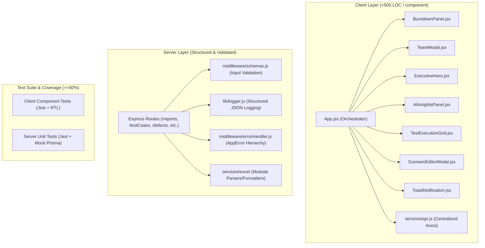

# Implementation Plan: Datafactor Score Remediation & Architectural Enhancement

This plan addresses every item identified in the **Datafactor review report** (current score: **44.4%**, target: **70%+ / 85-95%+**). It provides systematic, end-to-end fixes across all 8 evaluation dimensions: Architecture & Robustness, Code Cleanliness, Test Coverage, CI/CD Maturity, Security Hygiene, Dependency Health, Docs & Onboarding, and Maintenance.

---

## User Review Required

> [!IMPORTANT]
> - **God File Refactoring**: `client/src/App.jsx` (3,961 LOC) and `server/services/testCaseExcelService.js` (754 LOC) will be split into smaller, focused modules (<500 LOC each). All existing features, states, and event handlers will be preserved without breaking changes.
> - **Error Handling**: `alert()` dialogs in the UI will be replaced by a non-blocking modern Toast notification system integrated with typed API error responses.
> - **Prisma Mocking in Tests**: Server unit tests will fully mock Prisma so `npm test --workspace=server` runs anywhere instantly without needing a running Postgres instance.

---

## Proposed Changes



---

### Component 1: Code Cleanliness & Architecture (Frontend Modularization)

Refactor large monolithic components and deduplicate API boilerplate.

#### [NEW] [api.js](file:///d:/github%20repos/Test%20Nexus/client/src/services/api.js)
- Centralized Axios instance with base URL resolution, auth token interceptors, standard request timeout, and structured error extraction.

#### [NEW] [ToastNotification.jsx](file:///d:/github%20repos/Test%20Nexus/client/src/components/ToastNotification.jsx)
- Toast provider and UI for sleek, non-blocking error/success notifications, eliminating `alert()`.

#### [NEW] [useToast.js](file:///d:/github%20repos/Test%20Nexus/client/src/hooks/useToast.js)
- Custom hook providing `toast.success(msg)`, `toast.error(msg)`, `toast.info(msg)`.

#### [NEW] [BurndownPanel.jsx](file:///d:/github%20repos/Test%20Nexus/client/src/components/BurndownPanel.jsx)
- Extracted execution burndown chart, ideal vs actual progression, velocity indicators, and date filters.

#### [NEW] [TeamModal.jsx](file:///d:/github%20repos/Test%20Nexus/client/src/components/TeamModal.jsx)
- Extracted team capacity and tester management modal with localized state for adding/editing testers.

#### [NEW] [ExecutiveHero.jsx](file:///d:/github%20repos/Test%20Nexus/client/src/components/ExecutiveHero.jsx)
- Extracted top summary cards: total test cases, pass/fail/blocker percentages, and health badge.

#### [NEW] [AIInsightsPanel.jsx](file:///d:/github%20repos/Test%20Nexus/client/src/components/AIInsightsPanel.jsx)
- Extracted AI Advisor sidebar/feed displaying slippage alerts, focus areas, and workload suggestions.

#### [NEW] [TestExecutionGrid.jsx](file:///d:/github%20repos/Test%20Nexus/client/src/components/TestExecutionGrid.jsx)
- Extracted test execution table, status update toggles, bulk assignment, and search filters.

#### [NEW] [ScenarioEditorModal.jsx](file:///d:/github%20repos/Test%20Nexus/client/src/components/ScenarioEditorModal.jsx)
- Extracted scenario and journey editor dialog.

#### [NEW] [useScenarioEditor.js](file:///d:/github%20repos/Test%20Nexus/client/src/hooks/useScenarioEditor.js)
- Custom hook managing scenario editing state, form dirty checking, and submission.

#### [MODIFY] [AdminDashboard.jsx](file:///d:/github%20repos/Test%20Nexus/client/src/components/AdminDashboard.jsx)
- Refactor to consume centralized `api.js` and `useToast`, separating data-fetching from rendering and bringing file length under 350 LOC.

#### [MODIFY] [App.jsx](file:///d:/github%20repos/Test%20Nexus/client/src/App.jsx)
- Modularize into the clean orchestrator layout, importing the new components, reducing file size from 3,961 LOC down to <500 LOC.

---

### Component 2: Backend Architecture, Logging & Error Handling

Provide structured logging and typed, centralized error handling.

#### [MODIFY] [logger.js](file:///d:/github%20repos/Test%20Nexus/server/lib/logger.js)
- Standardized structured JSON logger with timestamp, log level, request metadata context, and error stack serialization.

#### [MODIFY] [errorHandler.js](file:///d:/github%20repos/Test%20Nexus/server/middleware/errorHandler.js)
- Implement `AppError` base class with derived types:
  - `ValidationError` (400)
  - `UnauthorizedError` (401)
  - `ForbiddenError` (403)
  - `NotFoundError` (404)
  - `ConflictError` (409)
- Centralized error response formatter returning `{ error: message, code, details, statusCode }`.

#### [MODIFY] [index.js](file:///d:/github%20repos/Test%20Nexus/server/index.js)
- Connect logger and register `errorHandler` as the final Express middleware.

#### [MODIFY] [reports.js](file:///d:/github%20repos/Test%20Nexus/server/routes/reports.js)
#### [MODIFY] [testCases.js](file:///d:/github%20repos/Test%20Nexus/server/routes/testCases.js)
#### [MODIFY] [defects.js](file:///d:/github%20repos/Test%20Nexus/server/routes/defects.js)
- Replace raw `console.log` / `console.error` with `logger.info` / `logger.error` and forward async errors to `next(err)`.

---

### Component 3: Input Validation & Boundary Security

Enforce consistent validation across all HTTP endpoints.

#### [NEW] [schemas.js](file:///d:/github%20repos/Test%20Nexus/server/middleware/schemas.js)
- Declarative validation schemas for:
  - Reports generation (`projectId`, `dateRange`, `format`)
  - Test Cases CRUD (`title`, `status`, `assignedTo`, `priority`, `module`)
  - Defects CRUD (`title`, `severity`, `status`, `testCaseId`, `assignedTo`)
  - Project CRUD (`name`, `description`, `color`, `logo`)
  - User / Auth (`email`, `password`, `role`)

#### [MODIFY] [validate.js](file:///d:/github%20repos/Test%20Nexus/server/middleware/validate.js)
- Enhance validation middleware to validate `req.params`, `req.query`, and `req.body` with specific error codes.

#### [MODIFY] [routes](file:///d:/github%20repos/Test%20Nexus/server/routes)
- Attach `validate(schema)` across all route handlers in `testCases.js`, `reports.js`, `defects.js`, `projects.js`, `users.js`.

---

### Component 4: Test Coverage & Offline Testing (Jest + Mock Prisma)

Expand test suite from 2 files to comprehensive coverage with >=50% thresholds.

#### [NEW] [reports.test.js](file:///d:/github%20repos/Test%20Nexus/server/routes/__tests__/reports.test.js)
- Unit tests for report generation, summary calculations, CSV/Excel export logic with mocked Prisma.

#### [NEW] [testCases.test.js](file:///d:/github%20repos/Test%20Nexus/server/routes/__tests__/testCases.test.js)
- Unit tests for test case CRUD, filtering, status transitions, batch updates, and 400 validation rejection.

#### [NEW] [auth.test.js](file:///d:/github%20repos/Test%20Nexus/server/routes/__tests__/auth.test.js)
- Unit tests for login, registration, password hashing, and JWT issuance with mocked Prisma.

#### [NEW] [errorHandler.test.js](file:///d:/github%20repos/Test%20Nexus/server/middleware/__tests__/errorHandler.test.js)
- Unit tests verifying typed `AppError` subclasses and JSON response status codes.

#### [NEW] [AdminDashboard.test.jsx](file:///d:/github%20repos/Test%20Nexus/client/src/components/__tests__/AdminDashboard.test.jsx)
- Tests covering data fetching, project deletion, request approvals, and role updates.

#### [NEW] [BurndownPanel.test.jsx](file:///d:/github%20repos/Test%20Nexus/client/src/components/__tests__/BurndownPanel.test.jsx)
- Tests verifying ideal vs actual chart rendering, zero-state display, and metric calculations.

#### [NEW] [TeamModal.test.jsx](file:///d:/github%20repos/Test%20Nexus/client/src/components/__tests__/TeamModal.test.jsx)
- Tests for adding, editing, and deleting team members.

#### [MODIFY] [package.json (client & server)](file:///d:/github%20repos/Test%20Nexus/server/package.json)
- Add `--coverage` and coverage thresholds (>=50% lines/branches/functions/statements) in Jest configuration.

---

### Component 5: CI/CD Maturity, Documentation & Repo Health

#### [MODIFY] [ci.yml](file:///d:/github%20repos/Test%20Nexus/.github/workflows/ci.yml)
- Split into distinct jobs:
  1. `lint-and-format`: client and server linting + prettier check.
  2. `unit-tests`: fast, dependency-free offline unit test suite with coverage collection.
  3. `integration-tests`: runs Prisma migrations and DB-backed integration tests in isolated Postgres container.
  4. `dependency-audit`: checks for high-severity vulnerabilities.
  5. `build`: verifies client bundle compilation.

#### [MODIFY] [README.md](file:///d:/github%20repos/Test%20Nexus/README.md)
- Add Mermaid architectural diagram, testing instructions (`npm test`), fresh-clone setup steps, and environment variable documentation.

#### [MODIFY] [CHANGELOG.md](file:///d:/github%20repos/Test%20Nexus/CHANGELOG.md)
- Add `[Unreleased]` section detailing architectural refactoring, structured logging, validation, and test suite expansion.

---

## Verification Plan

### Automated Tests
1. **Server Unit Tests & Coverage**:
   ```bash
   npm test --workspace=server
   ```
   *Requirement*: Runs 100% offline without `DATABASE_URL` or Docker, passes all tests, and prints >=50% coverage.

2. **Client Component Tests & Coverage**:
   ```bash
   npm test --workspace=client
   ```
   *Requirement*: Passes all component and hook tests with clean coverage report.

3. **Combined Workspace Test Suite**:
   ```bash
   npm test
   ```
   *Requirement*: Both client and server exit with code 0.

4. **Linting & Type Safety**:
   ```bash
   npm run lint --workspace=client
   ```
   *Requirement*: 0 errors, 0 warnings.

5. **Client Production Build**:
   ```bash
   npm run build --workspace=client
   ```
   *Requirement*: Builds cleanly into `dist` without errors.

6. **File Size Audit**:
   *Requirement*: Verify no file in `client/src` or `server` exceeds 500 lines of code.

### Manual Verification
- Launch application (`npm run dev`) and test core user flows:
  - Test case import / export
  - Burndown chart interactions
  - Team member management
  - Admin dashboard actions & Toast notifications
