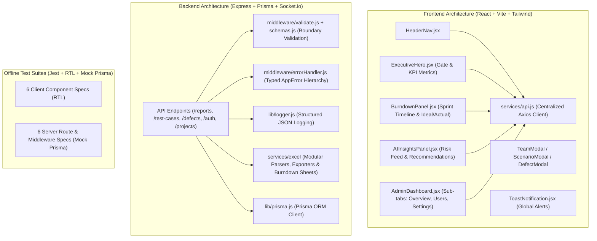

# Test Nexus

> **Premium Test Management Platform** — manage test cases, run burndown analytics, generate AI-powered test scenarios, track defects, and collaborate with your team.

---

## Features

- 📋 **Test Case Management** — create, edit, and filter test suites with custom validation columns
- 🔥 **Burndown Charts** — sprint progress visualised in real time
- 🤖 **AI Scenario Lab** — Gemini-powered test case generation from plain-English descriptions
- 📊 **Defect Tracker** — raise, own, and export defects linked to test cases
- 📤 **Excel Import / Export** — round-trip sync with `.xlsx` Execution Tracker sheets
- 🔐 **Role-Based Access** — Admin, Owner, and Viewer roles with subscription gating
- 🌐 **Multi-Project Tabs** — switch between projects with per-project theme colours and logos
- 🔔 **Real-Time Agent Logs** — Socket.io-powered live update feed

---

## Quick Start

### Prerequisites

| Tool | Minimum Version |
|------|----------------|
| Node.js | 18.x |
| npm | 9.x |
| PostgreSQL | 14.x |

### 1. Clone & install

```bash
git clone https://github.com/your-org/Test-Nexus.git
cd Test-Nexus
npm install
```

### 2. Configure environment

```bash
cp .env.example .env
# Edit .env with your DATABASE_URL, JWT_SECRET, and GEMINI_API_KEY
```

### 3. Run database migrations

```bash
cd server
npx prisma migrate deploy
npx prisma generate
cd ..
```

### 4. Start development servers

```bash
npm run dev
```

This starts both the Vite dev server (port 3000) and the Express API (port 5000) concurrently.

---

## Docker (Containerised Setup)

```bash
cp .env.example .env
docker compose up --build
```

| Service | URL |
|---------|-----|
| React client | http://localhost:3000 |
| Express API | http://localhost:5000 |
| PostgreSQL | localhost:5432 |

---

## Architecture Overview



---

## Running Tests

The test suite runs **100% offline** without needing a live PostgreSQL instance or Docker container, thanks to global Prisma mocks.

```bash
# Run all workspace test suites with coverage
npm test

# Run frontend tests only
npm run test --workspace=client

# Run backend tests only
npm run test --workspace=server
```

---

## Project Structure

```
Test-Nexus/
├── client/                  # Vite + React frontend
│   ├── src/
│   │   ├── components/      # UI components (ExecutiveHero, BurndownPanel, etc.)
│   │   │   ├── admin/       # Sub-tabs for Admin Command Center
│   │   │   └── __tests__/   # RTL component test suites
│   │   ├── hooks/           # useToast, useScenarioEditor, useSocket, useBurndown
│   │   ├── services/        # Centralized Axios API client (api.js)
│   │   └── i18n/            # Translation strings
│   └── package.json
├── server/                  # Express API
│   ├── lib/                 # Structured JSON logger & Prisma singleton
│   ├── middleware/          # Typed error handler, schema validation, auth
│   ├── prisma/              # Prisma schema & migrations
│   ├── routes/              # Route handlers with input validation
│   │   └── __tests__/       # Supertest route integration specs
│   ├── services/            # Business logic
│   │   └── excel/           # Modular Excel exporters, parsers & burndown sheets
│   └── package.json
├── .env.example             # Environment variable template
├── docker-compose.yml       # Container setup
└── package.json             # Workspace root
```


---

## Scripts

| Command | Description |
|---------|-------------|
| `npm run dev` | Start all dev servers concurrently |
| `npm run build` | Production build (outputs to `dist/`) |
| `npm test` | Run all test suites |
| `npm run lint` | Lint the frontend codebase |

---

## Contributing

See [CONTRIBUTING.md](CONTRIBUTING.md) for guidelines.

## Changelog

See [CHANGELOG.md](CHANGELOG.md) for release history.

## License

ISC
